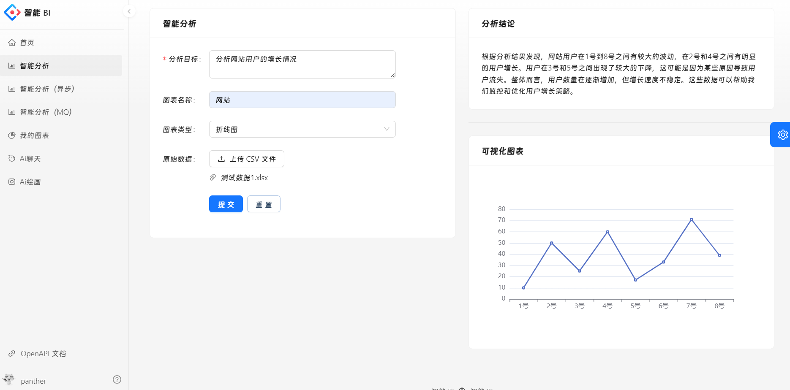

# 智能BI平台 🔎

> 一个 AI 自动分析平台，不需要选择分析数据，传入数据以及问题即可得到分析结论。
>
> 基于 **Spring Boot + Redis + RabbitMQ + MyBatis Plus + AIGC** 的智能数据分析平台。区别于传统的BI，数据分析者只需要导入最原始的数据集，输入想要进行分析的目标，就能利用AI自动生成一个符合要求的图表以及分析结论。此外，还会有图表管理、异步生成等功能。只需输入分析目标、原始数据和原始问题，利用 AI 就能一键生成可视化图表、分析结论，大幅降低人工数据分析成本。
>
> **优势：** 让不会数据分析的用户也可以通过输入目标快速完成数据分析，大幅节约人力成本，将会用到 AI 接口生成分析结果。
>
> 一个全栈前后端分离项目，已部署上线，仍有不足和需要扩展的地方，后续将持续进行扩展优化。
>


## 系统架构 ⭐
### 基础架构
基础架构：客户端输入分析诉求和原始数据，向业务后端发送请求。业务后端利用AI服务处理客户端数据，保持到数据库，并生成图表。处理后的数据由业务后端发送给AI服务，AI服务生成结果并返回给后端，最终将结果返回给客户端展示。


### 优化项目架构-异步化处理
优化流程（异步化）：客户端输入分析诉求和原始数据，向业务后端发送请求。业务后端将请求事件放入消息队列，并为客户端生成取餐号，让要生成图表的客户端去排队，消息队列根据I服务负载情况，定期检查进度，如果AI服务还能处理更多的图表生成请求，就向任务处理模块发送消息。

任务处理模块调用AI服务处理客户端数据，AI 服务异步生成结果返回给后端并保存到数据库，当后端的AI工服务生成完毕后，可以通过向前端发送通知的方式，或者通过业务后端监控数据库中图表生成服务的状态，来确定生成结果是否可用。若生成结果可用，前端即可获取并处理相应的数据，最终将结果返回给客户端展示。在此期间，用户可以去做自己的事情。


## 项目技术栈 🔥

### 前端
- 开发框架：React、Umi
- 脚手架：Ant Design Pro
- 组件库：Ant Designts
- 前后端联调：OpenAPI 插件
- 语法扩展：TypeScript、Less
- 打包工具：Webpack
- 代码规范：ESLint、StyleLint、Prettier
- 图表：ECharts


### 后端

- 主语言：Java
- 框架：SpringBoot 2.7.2、Mybatis-plus
- 数据库：Mysql5.7、Redis
- 限流控制：Redissson
- 消息队列：RabbitMQ
- AI调用：AI SDK
- 异步化：JDK 线程池
- 表格数据处理：Easy Excel
- 前后端联调：Swagger，Knife4j
- 发送请求：Hutool 


## 功能模块 🎊

> 🌟 亮点功能
>
> 🚀 未来计划

- 登录注册注销
- 同步生成图表
- 🌟异步生成图表
- 查看图表结果
- 查看图表详情

- 下载 测试数据
- 个人主页（🚀）
- 接入AI助手提问（🚀）


## BI项目展示 🎰
- 用户登录注册


- 首页介绍项目


- 同步分析数据生成图表



- 异步分析数据生成图表


- 图表管理查看界面


- 个人页面


- 测试数据下载


## 快速上手 🏃‍♂️

### 后端

1. 将配置修改成你自己对应的端口、账号、密码等等
2. 启动Mysql、Redis、RabbitMQ（如需修改依赖版本，请自行查找对应适配版本）
3. 启动服务


### 前端

环境要求：Node.js >= 18

安装依赖：

```
npm i @ant-design/pro-cli -g
npm i
```


启动：

```
npm run start:dev
```


## 欢迎贡献 👨‍👨‍👦‍👦

项目需要大家的支持，期待更多小伙伴的贡献，你可以：

- 对于项目中的Bug和建议，能够在Issues区提出建议，我会积极响应

